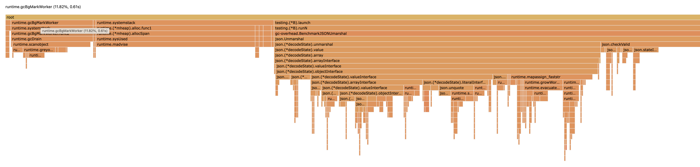

# gc-overhead

A quick exploration of the gc overhead reported by `GODEBUG=gctrace=1` vs Go's CPU profiler.

To reproduce run:

```
$ GODEBUG=gctrace=1 go test -bench . -count 3 -cpuprofile=cpu.pprof | tee gctrace.txt
```

On my machine, the CPU profiler reports an average of ~17%.


But the output of `GODEBUG=gctrace=1` indicates overhead of around 1 percent:

```
$ awk 'BEGIN {sum = 0; n = 0}; $4~/%/ {sum += $4; n += 1}; END {print sum/n, "%"}' gctrace.txt 
1.26562 %
```

<details>
  <summary>Click to see output</summary>

```
gc 1 @0.007s 1%: 0.010+1.6+0.089 ms clock, 0.12+0.12/0.76/0+1.0 ms cpu, 4->4->0 MB, 4 MB goal, 0 MB stacks, 0 MB globals, 12 P
gc 2 @0.014s 2%: 0.081+1.3+0.037 ms clock, 0.98+0.088/1.4/0+0.44 ms cpu, 4->4->1 MB, 4 MB goal, 0 MB stacks, 0 MB globals, 12 P
gc 3 @0.027s 1%: 0.023+0.25+0.016 ms clock, 0.28+0.050/0.40/0.13+0.20 ms cpu, 4->4->0 MB, 4 MB goal, 0 MB stacks, 0 MB globals, 12 P
gc 4 @0.044s 1%: 0.039+0.33+0.019 ms clock, 0.47+0.10/0.36/0.33+0.23 ms cpu, 4->4->0 MB, 4 MB goal, 0 MB stacks, 0 MB globals, 12 P
gc 5 @0.054s 1%: 0.076+0.68+0.036 ms clock, 0.91+0.13/0.86/0+0.44 ms cpu, 4->4->0 MB, 4 MB goal, 0 MB stacks, 0 MB globals, 12 P
gc 6 @0.058s 1%: 0.19+0.90+0.025 ms clock, 2.3+0.12/0.64/0+0.30 ms cpu, 4->4->1 MB, 4 MB goal, 0 MB stacks, 0 MB globals, 12 P
gc 7 @0.063s 1%: 0.096+0.83+0.034 ms clock, 1.1+0.10/0.86/0+0.41 ms cpu, 4->4->1 MB, 4 MB goal, 0 MB stacks, 0 MB globals, 12 P
gc 8 @0.067s 2%: 0.057+0.76+0.024 ms clock, 0.68+0.058/1.1/0.026+0.29 ms cpu, 4->4->1 MB, 4 MB goal, 0 MB stacks, 0 MB globals, 12 P
gc 9 @0.071s 2%: 0.087+0.75+0.002 ms clock, 1.0+0.099/1.1/0+0.033 ms cpu, 4->4->1 MB, 4 MB goal, 0 MB stacks, 0 MB globals, 12 P
gc 10 @0.088s 5%: 2.9+3.2+0.10 ms clock, 35+0.12/1.5/0+1.3 ms cpu, 4->4->1 MB, 4 MB goal, 0 MB stacks, 0 MB globals, 12 P
gc 11 @0.112s 7%: 2.6+5.5+2.0 ms clock, 31+1.3/0/0+24 ms cpu, 4->4->1 MB, 4 MB goal, 0 MB stacks, 0 MB globals, 12 P
gc 12 @0.128s 9%: 2.9+3.2+0.003 ms clock, 35+1.2/0/0+0.045 ms cpu, 4->4->1 MB, 4 MB goal, 0 MB stacks, 0 MB globals, 12 P
gc 13 @0.138s 9%: 0.042+1.2+0.085 ms clock, 0.50+0.089/1.5/0+1.0 ms cpu, 4->4->1 MB, 4 MB goal, 0 MB stacks, 0 MB globals, 12 P
gc 14 @0.146s 8%: 0.038+0.48+0.002 ms clock, 0.46+0.29/0.92/0.54+0.026 ms cpu, 4->4->1 MB, 4 MB goal, 0 MB stacks, 0 MB globals, 12 P
gc 15 @0.150s 8%: 0.058+0.48+0.002 ms clock, 0.70+0.51/1.1/0.042+0.030 ms cpu, 4->4->1 MB, 4 MB goal, 0 MB stacks, 0 MB globals, 12 P
gc 16 @0.152s 8%: 0.064+0.48+0.021 ms clock, 0.77+0.61/1.0/0+0.25 ms cpu, 4->4->1 MB, 4 MB goal, 0 MB stacks, 0 MB globals, 12 P
gc 17 @0.154s 8%: 0.048+0.47+0.002 ms clock, 0.58+0.58/1.0/0.039+0.025 ms cpu, 4->4->1 MB, 4 MB goal, 0 MB stacks, 0 MB globals, 12 P
gc 18 @0.158s 8%: 0.037+0.53+0.034 ms clock, 0.44+0.37/1.0/0.41+0.41 ms cpu, 4->4->1 MB, 4 MB goal, 0 MB stacks, 0 MB globals, 12 P
gc 19 @0.161s 8%: 0.093+1.5+0.13 ms clock, 1.1+0.33/1.2/0+1.5 ms cpu, 4->4->2 MB, 4 MB goal, 0 MB stacks, 0 MB globals, 12 P
gc 20 @0.169s 9%: 0.97+4.8+0.83 ms clock, 11+0.10/1.7/0+10 ms cpu, 4->4->2 MB, 4 MB goal, 0 MB stacks, 0 MB globals, 12 P
# github.com/felixge/dump/gc-overhead.test
gc 1 @0.004s 4%: 0.014+1.5+0.019 ms clock, 0.16+0.90/2.0/0.25+0.23 ms cpu, 4->4->2 MB, 4 MB goal, 0 MB stacks, 0 MB globals, 12 P
gc 2 @0.010s 5%: 0.078+1.1+0.028 ms clock, 0.94+0.58/2.4/0.87+0.33 ms cpu, 6->7->5 MB, 6 MB goal, 0 MB stacks, 0 MB globals, 12 P
gc 21 @0.204s 8%: 0.38+2.6+0.016 ms clock, 4.6+0.18/1.1/0+0.20 ms cpu, 4->4->1 MB, 5 MB goal, 0 MB stacks, 0 MB globals, 12 P
# github.com/felixge/dump/gc-overhead.test
gc 1 @0.001s 5%: 0.010+1.0+0.019 ms clock, 0.12+0.21/1.4/1.5+0.23 ms cpu, 4->4->3 MB, 4 MB goal, 0 MB stacks, 0 MB globals, 12 P
gc 2 @0.005s 4%: 0.008+2.8+0.002 ms clock, 0.10+1.1/1.2/0.079+0.034 ms cpu, 7->7->6 MB, 7 MB goal, 0 MB stacks, 0 MB globals, 12 P
gc 3 @0.012s 3%: 0.021+0.57+0.017 ms clock, 0.26+0.091/1.1/0.51+0.20 ms cpu, 14->14->13 MB, 14 MB goal, 0 MB stacks, 0 MB globals, 12 P
gc 4 @0.086s 1%: 0.095+2.5+0.049 ms clock, 1.1+0.36/4.8/0+0.59 ms cpu, 26->28->14 MB, 27 MB goal, 0 MB stacks, 0 MB globals, 12 P
gc 5 @0.112s 1%: 0.096+2.3+0.056 ms clock, 1.1+0/5.8/1.0+0.68 ms cpu, 28->29->19 MB, 30 MB goal, 0 MB stacks, 0 MB globals, 12 P
gc 1 @0.001s 3%: 0.025+0.25+0.015 ms clock, 0.30+0/0.27/0.047+0.18 ms cpu, 1->1->1 MB, 4 MB goal, 0 MB stacks, 0 MB globals, 12 P (forced)
gc 2 @0.001s 5%: 0.033+0.10+0.001 ms clock, 0.40+0/0.15/0.043+0.018 ms cpu, 1->1->1 MB, 4 MB goal, 0 MB stacks, 0 MB globals, 12 P (forced)
goos: darwin
goarch: amd64
pkg: github.com/felixge/dump/gc-overhead
cpu: Intel(R) Core(TM) i7-9750H CPU @ 2.60GHz
BenchmarkJSONUmarshal-12        gc 3 @0.002s 5%: 0.030+0.12+0.001 ms clock, 0.36+0/0.16/0.021+0.017 ms cpu, 1->1->1 MB, 4 MB goal, 0 MB stacks, 0 MB globals, 12 P (forced)
gc 4 @0.010s 3%: 0.055+0.61+0.020 ms clock, 0.67+0.085/1.2/0.53+0.24 ms cpu, 4->4->3 MB, 4 MB goal, 0 MB stacks, 0 MB globals, 12 P
gc 5 @0.011s 3%: 0.030+0.13+0.001 ms clock, 0.37+0/0.16/0.017+0.017 ms cpu, 3->3->1 MB, 6 MB goal, 0 MB stacks, 0 MB globals, 12 P (forced)
gc 6 @0.018s 2%: 0.032+0.62+0.023 ms clock, 0.39+0.048/1.2/0.26+0.28 ms cpu, 4->4->3 MB, 4 MB goal, 0 MB stacks, 0 MB globals, 12 P
gc 7 @0.028s 2%: 0.038+0.97+0.021 ms clock, 0.45+0.050/2.5/0.77+0.26 ms cpu, 6->6->5 MB, 6 MB goal, 0 MB stacks, 0 MB globals, 12 P
gc 8 @0.046s 2%: 0.045+2.1+0.020 ms clock, 0.54+0.11/5.2/1.7+0.24 ms cpu, 11->11->9 MB, 11 MB goal, 0 MB stacks, 0 MB globals, 12 P
gc 9 @0.079s 2%: 0.041+3.1+0.002 ms clock, 0.49+0.62/8.8/6.1+0.028 ms cpu, 19->20->17 MB, 19 MB goal, 0 MB stacks, 0 MB globals, 12 P
gc 10 @0.133s 2%: 0.064+3.9+0.017 ms clock, 0.77+0.10/11/11+0.21 ms cpu, 33->33->29 MB, 34 MB goal, 0 MB stacks, 0 MB globals, 12 P
gc 11 @0.221s 2%: 0.065+6.6+0.022 ms clock, 0.78+0.097/19/12+0.27 ms cpu, 57->58->50 MB, 58 MB goal, 0 MB stacks, 0 MB globals, 12 P
gc 12 @0.368s 2%: 0.065+11+0.047 ms clock, 0.78+0.22/34/30+0.56 ms cpu, 98->100->86 MB, 101 MB goal, 0 MB stacks, 0 MB globals, 12 P
gc 13 @0.629s 1%: 0.065+19+0.022 ms clock, 0.78+0.13/57/52+0.26 ms cpu, 169->173->149 MB, 173 MB goal, 0 MB stacks, 0 MB globals, 12 P
gc 14 @0.823s 1%: 0.062+0.20+0.001 ms clock, 0.75+0/0.35/0.22+0.022 ms cpu, 210->210->1 MB, 298 MB goal, 0 MB stacks, 0 MB globals, 12 P (forced)
gc 15 @0.842s 1%: 0.086+0.71+0.069 ms clock, 1.0+0.12/1.4/0.42+0.83 ms cpu, 4->4->3 MB, 4 MB goal, 0 MB stacks, 0 MB globals, 12 P
gc 16 @0.853s 1%: 0.10+1.2+0.017 ms clock, 1.2+0.21/3.0/1.2+0.21 ms cpu, 6->6->5 MB, 6 MB goal, 0 MB stacks, 0 MB globals, 12 P
gc 17 @0.868s 1%: 0.066+2.5+0.017 ms clock, 0.80+0.010/6.2/2.7+0.20 ms cpu, 10->11->9 MB, 11 MB goal, 0 MB stacks, 0 MB globals, 12 P
gc 18 @0.894s 1%: 0.11+3.8+0.017 ms clock, 1.4+0.048/9.3/7.3+0.21 ms cpu, 18->20->16 MB, 19 MB goal, 0 MB stacks, 0 MB globals, 12 P
gc 19 @0.937s 1%: 0.065+4.6+0.020 ms clock, 0.78+0.069/12/14+0.25 ms cpu, 31->33->28 MB, 33 MB goal, 0 MB stacks, 0 MB globals, 12 P
gc 20 @1.008s 1%: 0.034+6.5+0.017 ms clock, 0.41+0.048/18/13+0.21 ms cpu, 54->56->48 MB, 56 MB goal, 0 MB stacks, 0 MB globals, 12 P
gc 21 @1.138s 1%: 0.050+15+0.024 ms clock, 0.60+0.073/44/31+0.29 ms cpu, 93->95->82 MB, 96 MB goal, 0 MB stacks, 0 MB globals, 12 P
gc 22 @1.361s 1%: 0.038+19+0.019 ms clock, 0.46+0.034/56/52+0.23 ms cpu, 159->164->141 MB, 164 MB goal, 0 MB stacks, 0 MB globals, 12 P
gc 23 @1.748s 1%: 0.062+30+0.020 ms clock, 0.74+0.11/91/110+0.24 ms cpu, 271->278->239 MB, 282 MB goal, 0 MB stacks, 0 MB globals, 12 P
   14786             75647 ns/op
BenchmarkJSONUmarshal-12        gc 24 @1.954s 1%: 0.044+0.24+0.002 ms clock, 0.53+0/0.33/0.11+0.027 ms cpu, 303->303->1 MB, 479 MB goal, 0 MB stacks, 0 MB globals, 12 P (forced)
gc 25 @1.972s 1%: 0.036+0.25+0.022 ms clock, 0.44+0/0.25/0.21+0.27 ms cpu, 1->1->1 MB, 4 MB goal, 0 MB stacks, 0 MB globals, 12 P (forced)
gc 26 @1.980s 1%: 0.039+0.77+0.029 ms clock, 0.47+0.049/1.8/0.11+0.35 ms cpu, 4->4->3 MB, 4 MB goal, 0 MB stacks, 0 MB globals, 12 P
gc 27 @1.981s 1%: 0.032+0.16+0.001 ms clock, 0.38+0/0.21/0+0.020 ms cpu, 3->3->1 MB, 6 MB goal, 0 MB stacks, 0 MB globals, 12 P (forced)
gc 28 @1.989s 1%: 1.4+6.0+0.003 ms clock, 17+1.5/0/0+0.046 ms cpu, 4->4->3 MB, 4 MB goal, 0 MB stacks, 0 MB globals, 12 P
gc 29 @2.010s 1%: 1.4+5.6+0.003 ms clock, 17+1.2/2.6/0+0.042 ms cpu, 6->7->6 MB, 7 MB goal, 0 MB stacks, 0 MB globals, 12 P
gc 30 @2.039s 1%: 0.041+4.4+0.024 ms clock, 0.49+0.22/6.9/0.76+0.29 ms cpu, 12->12->10 MB, 12 MB goal, 0 MB stacks, 0 MB globals, 12 P
gc 31 @2.072s 1%: 0.077+3.5+0.018 ms clock, 0.93+0.058/9.8/2.5+0.22 ms cpu, 20->21->18 MB, 21 MB goal, 0 MB stacks, 0 MB globals, 12 P
gc 32 @2.123s 1%: 0.059+4.7+0.026 ms clock, 0.71+0.077/13/8.0+0.32 ms cpu, 35->36->31 MB, 36 MB goal, 0 MB stacks, 0 MB globals, 12 P
gc 33 @2.203s 1%: 0.059+7.3+0.018 ms clock, 0.71+0.075/21/13+0.22 ms cpu, 61->63->54 MB, 63 MB goal, 0 MB stacks, 0 MB globals, 12 P
gc 34 @2.340s 1%: 0.058+12+0.034 ms clock, 0.70+0.069/35/26+0.41 ms cpu, 105->108->93 MB, 108 MB goal, 0 MB stacks, 0 MB globals, 12 P
gc 35 @2.586s 1%: 0.073+21+0.020 ms clock, 0.88+0.13/62/71+0.24 ms cpu, 180->186->160 MB, 186 MB goal, 0 MB stacks, 0 MB globals, 12 P
gc 36 @2.737s 1%: 0.043+0.10+0.002 ms clock, 0.52+0/0.22/0.074+0.024 ms cpu, 206->206->1 MB, 320 MB goal, 0 MB stacks, 0 MB globals, 12 P (forced)
gc 37 @2.755s 1%: 0.063+0.59+0.017 ms clock, 0.76+0.073/1.3/0.78+0.21 ms cpu, 4->4->3 MB, 4 MB goal, 0 MB stacks, 0 MB globals, 12 P
gc 38 @2.764s 1%: 0.058+1.7+0.023 ms clock, 0.70+0.054/4.1/0.40+0.28 ms cpu, 6->7->5 MB, 6 MB goal, 0 MB stacks, 0 MB globals, 12 P
gc 39 @2.780s 1%: 0.040+2.0+0.017 ms clock, 0.48+0.058/5.6/1.1+0.20 ms cpu, 11->11->9 MB, 11 MB goal, 0 MB stacks, 0 MB globals, 12 P
gc 40 @2.808s 1%: 0.035+3.0+0.019 ms clock, 0.42+0.052/8.2/3.5+0.23 ms cpu, 19->19->16 MB, 20 MB goal, 0 MB stacks, 0 MB globals, 12 P
gc 41 @2.853s 1%: 0.13+4.3+0.021 ms clock, 1.6+0.059/12/7.9+0.25 ms cpu, 33->34->29 MB, 34 MB goal, 0 MB stacks, 0 MB globals, 12 P
gc 42 @2.926s 1%: 0.059+6.7+0.024 ms clock, 0.71+0.070/19/12+0.29 ms cpu, 56->58->50 MB, 58 MB goal, 0 MB stacks, 0 MB globals, 12 P
gc 43 @3.053s 1%: 0.059+11+0.021 ms clock, 0.71+0.076/32/23+0.25 ms cpu, 98->101->86 MB, 100 MB goal, 0 MB stacks, 0 MB globals, 12 P
gc 44 @3.276s 1%: 0.058+17+0.019 ms clock, 0.70+0.076/52/65+0.23 ms cpu, 166->169->145 MB, 173 MB goal, 0 MB stacks, 0 MB globals, 12 P
gc 45 @3.668s 1%: 0.063+30+0.033 ms clock, 0.76+0.077/89/120+0.40 ms cpu, 285->290->249 MB, 290 MB goal, 0 MB stacks, 0 MB globals, 12 P
   15895             73063 ns/op
BenchmarkJSONUmarshal-12        gc 46 @3.910s 1%: 0.049+0.25+0.001 ms clock, 0.58+0/0.41/0.14+0.022 ms cpu, 328->328->1 MB, 499 MB goal, 0 MB stacks, 0 MB globals, 12 P (forced)
gc 47 @3.929s 1%: 0.081+0.27+0.017 ms clock, 0.98+0/0.22/0.10+0.21 ms cpu, 1->1->1 MB, 4 MB goal, 0 MB stacks, 0 MB globals, 12 P (forced)
gc 48 @3.937s 1%: 0.057+0.90+0.057 ms clock, 0.68+0.067/1.6/0.68+0.68 ms cpu, 4->4->3 MB, 4 MB goal, 0 MB stacks, 0 MB globals, 12 P
gc 49 @3.938s 1%: 0.047+0.34+0.022 ms clock, 0.57+0/0.30/0.036+0.26 ms cpu, 3->3->1 MB, 6 MB goal, 0 MB stacks, 0 MB globals, 12 P (forced)
gc 50 @3.946s 1%: 0.081+0.93+0.048 ms clock, 0.98+0.092/2.0/0.23+0.58 ms cpu, 4->4->3 MB, 4 MB goal, 0 MB stacks, 0 MB globals, 12 P
gc 51 @3.955s 1%: 0.032+1.3+0.022 ms clock, 0.38+0.044/3.5/0.31+0.26 ms cpu, 6->6->5 MB, 6 MB goal, 0 MB stacks, 0 MB globals, 12 P
gc 52 @3.972s 1%: 0.036+1.8+0.019 ms clock, 0.44+0.051/4.9/1.7+0.23 ms cpu, 11->11->9 MB, 11 MB goal, 0 MB stacks, 0 MB globals, 12 P
gc 53 @3.998s 1%: 0.037+2.8+0.036 ms clock, 0.45+0.047/8.0/3.3+0.43 ms cpu, 19->20->17 MB, 19 MB goal, 0 MB stacks, 0 MB globals, 12 P
gc 54 @4.041s 1%: 0.037+4.6+0.022 ms clock, 0.45+0.056/13/7.7+0.27 ms cpu, 32->34->29 MB, 34 MB goal, 0 MB stacks, 0 MB globals, 12 P
gc 55 @4.114s 1%: 0.060+6.7+0.017 ms clock, 0.72+0.069/19/12+0.21 ms cpu, 56->58->50 MB, 58 MB goal, 0 MB stacks, 0 MB globals, 12 P
gc 56 @4.238s 1%: 0.059+11+0.019 ms clock, 0.71+0.12/32/33+0.22 ms cpu, 96->99->85 MB, 100 MB goal, 0 MB stacks, 0 MB globals, 12 P
gc 57 @4.450s 1%: 0.035+18+0.019 ms clock, 0.42+0.046/54/52+0.23 ms cpu, 165->169->145 MB, 171 MB goal, 0 MB stacks, 0 MB globals, 12 P
gc 58 @4.642s 1%: 0.060+0.25+0.001 ms clock, 0.73+0/0.40/0.14+0.022 ms cpu, 211->211->1 MB, 292 MB goal, 0 MB stacks, 0 MB globals, 12 P (forced)
gc 59 @4.663s 1%: 0.076+0.74+0.044 ms clock, 0.92+0.11/1.5/0.55+0.53 ms cpu, 4->4->3 MB, 4 MB goal, 0 MB stacks, 0 MB globals, 12 P
gc 60 @4.672s 1%: 0.058+1.3+0.028 ms clock, 0.70+0.25/3.0/0.84+0.33 ms cpu, 6->6->5 MB, 6 MB goal, 0 MB stacks, 0 MB globals, 12 P
gc 61 @4.688s 1%: 0.060+2.3+0.033 ms clock, 0.72+0.11/6.4/0.63+0.40 ms cpu, 10->11->9 MB, 11 MB goal, 0 MB stacks, 0 MB globals, 12 P
gc 62 @4.716s 1%: 0.038+3.0+0.021 ms clock, 0.46+0.56/8.3/3.1+0.26 ms cpu, 19->20->16 MB, 19 MB goal, 0 MB stacks, 0 MB globals, 12 P
gc 63 @4.761s 1%: 0.054+4.2+0.022 ms clock, 0.65+0.046/11/7.0+0.27 ms cpu, 32->33->28 MB, 34 MB goal, 0 MB stacks, 0 MB globals, 12 P
gc 64 @4.834s 1%: 0.058+6.7+0.019 ms clock, 0.69+0.074/19/12+0.22 ms cpu, 56->58->49 MB, 57 MB goal, 0 MB stacks, 0 MB globals, 12 P
gc 65 @4.957s 1%: 0.061+11+0.022 ms clock, 0.73+0.089/33/22+0.27 ms cpu, 96->99->84 MB, 99 MB goal, 0 MB stacks, 0 MB globals, 12 P
gc 66 @5.179s 1%: 0.033+18+0.023 ms clock, 0.40+0.10/55/69+0.27 ms cpu, 165->170->146 MB, 170 MB goal, 0 MB stacks, 0 MB globals, 12 P
gc 67 @5.557s 1%: 0.057+30+0.020 ms clock, 0.68+0.072/90/131+0.24 ms cpu, 280->285->245 MB, 292 MB goal, 0 MB stacks, 0 MB globals, 12 P
   17073             72754 ns/op
PASS
ok      github.com/felixge/dump/gc-overhead     6.189s
```

</details>

## Why?

I think the percentage reported by `GODEBUG=gctrace=1` is relative to the total CPU time available to the program whereas pprof reports relative to the CPU time used by the program.

To proof this theory, we can reduce the amount of CPU time available to the benchmark using GOMAXPROCS:

```
GOMAXPROCS=1 GODEBUG=gctrace=1 go test -bench . -count 3 -cpuprofile=cpu.maxprocs1.pprof | tee gctrace.maxprocs1.txt
```



The gctrace now shows similar overhead to the cpu profile (~14% vs ~12%, the difference is due to `runtime.gcAssistAlloc`).

```
$ awk 'BEGIN {sum = 0; n = 0}; $4~/%/ {sum += $4; n += 1}; END {print sum/n, "%"}' gctrace.maxprocs1.txt 
14.2174 %
```

<details>
  <summary>Click to see output</summary>

```
GOMAXPROCS=1 GODEBUG=gctrace=1 go test -bench . -count 3 -cpuprofile=cpu.maxprocs1.pprof | tee gctrace.maxprocs1.txt
gc 1 @0.031s 1%: 0.006+1.6+0.001 ms clock, 0.006+0.40/0/0+0.001 ms cpu, 4->4->0 MB, 4 MB goal, 0 MB stacks, 0 MB globals, 1 P
gc 2 @0.057s 1%: 0.011+0.91+0.001 ms clock, 0.011+0.31/0/0+0.001 ms cpu, 4->4->0 MB, 4 MB goal, 0 MB stacks, 0 MB globals, 1 P
gc 3 @0.077s 1%: 0.017+0.66+0.001 ms clock, 0.017+0.35/0/0+0.001 ms cpu, 4->4->0 MB, 4 MB goal, 0 MB stacks, 0 MB globals, 1 P
gc 4 @0.099s 1%: 0.036+1.1+0.001 ms clock, 0.036+0.65/0/0+0.001 ms cpu, 4->4->0 MB, 4 MB goal, 0 MB stacks, 0 MB globals, 1 P
gc 5 @0.117s 2%: 0.036+1.1+0.001 ms clock, 0.036+0.63/0/0+0.001 ms cpu, 4->4->0 MB, 4 MB goal, 0 MB stacks, 0 MB globals, 1 P
gc 6 @0.133s 2%: 0.053+1.2+0.001 ms clock, 0.053+0.72/0.030/0+0.001 ms cpu, 4->4->1 MB, 4 MB goal, 0 MB stacks, 0 MB globals, 1 P
gc 7 @0.161s 2%: 0.23+1.1+0.001 ms clock, 0.23+0.98/0/0+0.001 ms cpu, 4->4->1 MB, 4 MB goal, 0 MB stacks, 0 MB globals, 1 P
gc 8 @0.169s 3%: 0.13+1.2+0.001 ms clock, 0.13+0.98/0/0+0.001 ms cpu, 4->4->1 MB, 4 MB goal, 0 MB stacks, 0 MB globals, 1 P
gc 9 @0.178s 3%: 0.035+1.1+0.001 ms clock, 0.035+0.97/0/0+0.001 ms cpu, 4->4->1 MB, 4 MB goal, 0 MB stacks, 0 MB globals, 1 P
gc 10 @0.187s 4%: 0.035+1.2+0.001 ms clock, 0.035+0.98/0/0+0.001 ms cpu, 4->4->1 MB, 4 MB goal, 0 MB stacks, 0 MB globals, 1 P
gc 11 @0.194s 4%: 0.032+1.1+0.001 ms clock, 0.032+0.98/0/0+0.001 ms cpu, 4->4->1 MB, 4 MB goal, 0 MB stacks, 0 MB globals, 1 P
gc 12 @0.200s 4%: 0.033+1.2+0.001 ms clock, 0.033+1.0/0/0+0.001 ms cpu, 4->4->1 MB, 4 MB goal, 0 MB stacks, 0 MB globals, 1 P
gc 13 @0.212s 5%: 0.068+1.5+0.001 ms clock, 0.068+1.1/0/0+0.001 ms cpu, 4->4->1 MB, 4 MB goal, 0 MB stacks, 0 MB globals, 1 P
gc 14 @0.221s 5%: 0.040+1.4+0.001 ms clock, 0.040+1.1/0/0+0.001 ms cpu, 4->4->1 MB, 4 MB goal, 0 MB stacks, 0 MB globals, 1 P
# github.com/felixge/dump/gc-overhead.test
gc 1 @0.004s 4%: 0.014+1.5+0.019 ms clock, 0.16+0.90/2.0/0.25+0.23 ms cpu, 4->4->2 MB, 4 MB goal, 0 MB stacks, 0 MB globals, 12 P
gc 2 @0.010s 5%: 0.078+1.1+0.028 ms clock, 0.94+0.58/2.4/0.87+0.33 ms cpu, 6->7->5 MB, 6 MB goal, 0 MB stacks, 0 MB globals, 12 P
# github.com/felixge/dump/gc-overhead.test
gc 1 @0.001s 58%: 0.007+2.3+0.001 ms clock, 0.007+2.3/0/0+0.001 ms cpu, 4->4->3 MB, 4 MB goal, 0 MB stacks, 0 MB globals, 1 P
gc 2 @0.005s 39%: 0.004+5.6+0.001 ms clock, 0.004+2.0/0/0+0.001 ms cpu, 6->7->7 MB, 7 MB goal, 0 MB stacks, 0 MB globals, 1 P
gc 3 @0.014s 32%: 0.022+3.1+0.001 ms clock, 0.022+1.4/0/0+0.001 ms cpu, 14->14->13 MB, 14 MB goal, 0 MB stacks, 0 MB globals, 1 P
gc 4 @0.075s 10%: 0.039+12+0.001 ms clock, 0.039+0.97/2.4/0+0.001 ms cpu, 23->25->14 MB, 27 MB goal, 0 MB stacks, 0 MB globals, 1 P
gc 5 @0.119s 8%: 0.023+21+0.001 ms clock, 0.023+0.86/2.4/0+0.001 ms cpu, 24->28->19 MB, 28 MB goal, 0 MB stacks, 0 MB globals, 1 P
gc 1 @0.000s 8%: 0.021+1.8+0.001 ms clock, 0.021+0/0.21/0+0.001 ms cpu, 1->1->1 MB, 4 MB goal, 0 MB stacks, 0 MB globals, 1 P (forced)
gc 2 @0.002s 8%: 0.018+0.10+0 ms clock, 0.018+0/0.012/0.087+0 ms cpu, 1->1->1 MB, 4 MB goal, 0 MB stacks, 0 MB globals, 1 P (forced)
goos: darwin
goarch: amd64
pkg: github.com/felixge/dump/gc-overhead
cpu: Intel(R) Core(TM) i7-9750H CPU @ 2.60GHz
BenchmarkJSONUmarshal   gc 3 @0.003s 8%: 0.028+0.10+0.001 ms clock, 0.028+0/0.013/0.090+0.001 ms cpu, 1->1->1 MB, 4 MB goal, 0 MB stacks, 0 MB globals, 1 P (forced)
gc 4 @0.012s 2%: 0.026+0.11+0.001 ms clock, 0.026+0/0.014/0.096+0.001 ms cpu, 3->3->1 MB, 4 MB goal, 0 MB stacks, 0 MB globals, 1 P (forced)
gc 5 @0.019s 7%: 0.031+1.5+0.001 ms clock, 0.031+1.2/0/0+0.001 ms cpu, 4->4->3 MB, 4 MB goal, 0 MB stacks, 0 MB globals, 1 P
gc 6 @0.027s 10%: 0.032+10+0.002 ms clock, 0.032+2.4/0/0+0.002 ms cpu, 5->7->6 MB, 6 MB goal, 0 MB stacks, 0 MB globals, 1 P
gc 7 @0.053s 13%: 0.031+18+0.001 ms clock, 0.031+3.4/2.2/0+0.001 ms cpu, 11->13->11 MB, 13 MB goal, 0 MB stacks, 0 MB globals, 1 P
gc 8 @0.099s 16%: 0.037+22+0.001 ms clock, 0.037+3.8/6.5/0+0.001 ms cpu, 20->22->19 MB, 23 MB goal, 0 MB stacks, 0 MB globals, 1 P
gc 9 @0.164s 18%: 0.041+47+0.002 ms clock, 0.041+5.7/12/0+0.002 ms cpu, 33->39->35 MB, 39 MB goal, 0 MB stacks, 0 MB globals, 1 P
gc 10 @0.287s 17%: 0.057+118+0.001 ms clock, 0.057+5.4/25/0+0.001 ms cpu, 59->79->70 MB, 70 MB goal, 0 MB stacks, 0 MB globals, 1 P
gc 11 @0.557s 17%: 0.058+189+0.002 ms clock, 0.058+5.0/56/0+0.002 ms cpu, 119->147->128 MB, 141 MB goal, 0 MB stacks, 0 MB globals, 1 P
   10000            106485 ns/op
BenchmarkJSONUmarshal   gc 12 @1.011s 15%: 0.055+164+0.002 ms clock, 0.055+5.0/49/67+0.002 ms cpu, 217->227->194 MB, 256 MB goal, 0 MB stacks, 0 MB globals, 1 P
gc 13 @1.181s 15%: 0.039+0.22+0.001 ms clock, 0.039+0/0.027/0.19+0.001 ms cpu, 194->194->1 MB, 388 MB goal, 0 MB stacks, 0 MB globals, 1 P (forced)
gc 14 @1.193s 15%: 0.024+1.1+0.001 ms clock, 0.024+0/0.13/0+0.001 ms cpu, 1->1->1 MB, 4 MB goal, 0 MB stacks, 0 MB globals, 1 P (forced)
gc 15 @1.202s 15%: 0.053+1.1+0.001 ms clock, 0.053+0/0.13/0+0.001 ms cpu, 3->3->1 MB, 4 MB goal, 0 MB stacks, 0 MB globals, 1 P (forced)
gc 16 @1.211s 15%: 0.050+1.6+0.001 ms clock, 0.050+1.3/0/0+0.001 ms cpu, 4->4->3 MB, 4 MB goal, 0 MB stacks, 0 MB globals, 1 P
gc 17 @1.219s 15%: 0.035+8.1+0.001 ms clock, 0.035+1.8/0.67/0+0.001 ms cpu, 5->6->6 MB, 6 MB goal, 0 MB stacks, 0 MB globals, 1 P
gc 18 @1.241s 15%: 0.031+13+0.002 ms clock, 0.031+2.5/2.7/0+0.002 ms cpu, 10->12->10 MB, 12 MB goal, 0 MB stacks, 0 MB globals, 1 P
gc 19 @1.277s 15%: 3.1+30+0.002 ms clock, 3.1+4.7/5.1/0+0.002 ms cpu, 18->22->19 MB, 21 MB goal, 0 MB stacks, 0 MB globals, 1 P
gc 20 @1.348s 16%: 0.046+54+0.002 ms clock, 0.046+4.5/14/0+0.002 ms cpu, 33->41->36 MB, 39 MB goal, 0 MB stacks, 0 MB globals, 1 P
gc 21 @1.472s 16%: 0.065+92+0.002 ms clock, 0.065+4.8/26/0+0.002 ms cpu, 62->77->67 MB, 73 MB goal, 0 MB stacks, 0 MB globals, 1 P
gc 22 @1.687s 16%: 0.057+199+0.002 ms clock, 0.057+5.7/54/0+0.002 ms cpu, 115->150->132 MB, 135 MB goal, 0 MB stacks, 0 MB globals, 1 P
gc 23 @2.134s 15%: 0.058+130+0.002 ms clock, 0.058+5.0/29/80+0.002 ms cpu, 224->228->192 MB, 264 MB goal, 0 MB stacks, 0 MB globals, 1 P
gc 24 @2.269s 15%: 0.025+0.16+0.001 ms clock, 0.025+0/0.015/0.14+0.001 ms cpu, 192->192->1 MB, 385 MB goal, 0 MB stacks, 0 MB globals, 1 P (forced)
gc 25 @2.288s 15%: 0.10+2.3+0.001 ms clock, 0.10+1.3/0/0+0.001 ms cpu, 4->4->3 MB, 4 MB goal, 0 MB stacks, 0 MB globals, 1 P
gc 26 @2.298s 15%: 0.043+10+0.002 ms clock, 0.043+2.8/0/0+0.002 ms cpu, 5->7->6 MB, 7 MB goal, 0 MB stacks, 0 MB globals, 1 P
gc 27 @2.324s 15%: 0.032+19+0.001 ms clock, 0.032+4.2/1.6/0+0.001 ms cpu, 12->15->13 MB, 14 MB goal, 0 MB stacks, 0 MB globals, 1 P
gc 28 @2.370s 15%: 0.057+38+0.002 ms clock, 0.057+4.0/7.1/0+0.002 ms cpu, 22->29->25 MB, 26 MB goal, 0 MB stacks, 0 MB globals, 1 P
gc 29 @2.454s 15%: 0.059+71+0.002 ms clock, 0.059+4.9/18/0+0.002 ms cpu, 43->55->47 MB, 51 MB goal, 0 MB stacks, 0 MB globals, 1 P
gc 30 @2.616s 15%: 0.062+140+0.002 ms clock, 0.062+5.3/36/0+0.002 ms cpu, 81->106->93 MB, 96 MB goal, 0 MB stacks, 0 MB globals, 1 P
gc 31 @2.923s 16%: 0.054+309+0.002 ms clock, 0.054+6.0/77/0+0.002 ms cpu, 158->214->187 MB, 186 MB goal, 0 MB stacks, 0 MB globals, 1 P
   12504             97832 ns/op
BenchmarkJSONUmarshal   gc 32 @3.504s 14%: 0.039+0.23+0.001 ms clock, 0.039+0/0.041/0.18+0.001 ms cpu, 281->281->1 MB, 376 MB goal, 0 MB stacks, 0 MB globals, 1 P (forced)
gc 33 @3.519s 14%: 0.028+1.1+0.001 ms clock, 0.028+0/0.16/0+0.001 ms cpu, 1->1->1 MB, 4 MB goal, 0 MB stacks, 0 MB globals, 1 P (forced)
gc 34 @3.528s 14%: 0.028+1.1+0.001 ms clock, 0.028+0/0.14/0+0.001 ms cpu, 3->3->1 MB, 4 MB goal, 0 MB stacks, 0 MB globals, 1 P (forced)
gc 35 @3.537s 14%: 0.036+2.5+0.001 ms clock, 0.036+1.4/0/0+0.001 ms cpu, 4->4->3 MB, 4 MB goal, 0 MB stacks, 0 MB globals, 1 P
gc 36 @3.546s 14%: 0.049+12+0.002 ms clock, 0.049+2.1/0.64/0+0.002 ms cpu, 5->7->6 MB, 7 MB goal, 0 MB stacks, 0 MB globals, 1 P
gc 37 @3.573s 14%: 0.047+20+0.002 ms clock, 0.047+4.4/1.8/0+0.002 ms cpu, 11->15->13 MB, 14 MB goal, 0 MB stacks, 0 MB globals, 1 P
gc 38 @3.620s 14%: 0.065+40+0.002 ms clock, 0.065+3.6/8.4/0+0.002 ms cpu, 22->29->25 MB, 26 MB goal, 0 MB stacks, 0 MB globals, 1 P
gc 39 @3.712s 15%: 0.031+62+0.002 ms clock, 0.031+6.2/16/0+0.002 ms cpu, 45->55->47 MB, 51 MB goal, 0 MB stacks, 0 MB globals, 1 P
gc 40 @3.861s 15%: 0.12+127+0.002 ms clock, 0.12+5.4/36/0+0.002 ms cpu, 80->101->89 MB, 94 MB goal, 0 MB stacks, 0 MB globals, 1 P
gc 41 @4.155s 15%: 0.11+260+0.002 ms clock, 0.11+18/61/0+0.002 ms cpu, 155->201->176 MB, 179 MB goal, 0 MB stacks, 0 MB globals, 1 P
gc 42 @4.520s 15%: 0.026+0.19+0.001 ms clock, 0.026+0/0.014/0.16+0.001 ms cpu, 215->215->1 MB, 352 MB goal, 0 MB stacks, 0 MB globals, 1 P (forced)
gc 43 @4.538s 15%: 0.059+1.5+0.001 ms clock, 0.059+1.3/0/0+0.001 ms cpu, 4->4->3 MB, 4 MB goal, 0 MB stacks, 0 MB globals, 1 P
gc 44 @4.546s 15%: 0.063+10+0.002 ms clock, 0.063+1.7/0.85/0+0.002 ms cpu, 5->7->6 MB, 6 MB goal, 0 MB stacks, 0 MB globals, 1 P
gc 45 @4.570s 15%: 0.054+23+0.002 ms clock, 0.054+4.5/1.1/0+0.002 ms cpu, 11->15->13 MB, 13 MB goal, 0 MB stacks, 0 MB globals, 1 P
gc 46 @4.621s 15%: 0.056+25+0.002 ms clock, 0.056+4.6/6.9/0+0.002 ms cpu, 22->26->22 MB, 26 MB goal, 0 MB stacks, 0 MB globals, 1 P
gc 47 @4.689s 15%: 0.046+61+0.001 ms clock, 0.046+4.9/14/0+0.001 ms cpu, 38->48->42 MB, 44 MB goal, 0 MB stacks, 0 MB globals, 1 P
gc 48 @4.843s 15%: 0.056+97+0.002 ms clock, 0.056+13/25/0+0.002 ms cpu, 79->93->80 MB, 86 MB goal, 0 MB stacks, 0 MB globals, 1 P
gc 49 @5.088s 15%: 0.056+207+0.002 ms clock, 0.056+10/61/0+0.002 ms cpu, 136->171->150 MB, 160 MB goal, 0 MB stacks, 0 MB globals, 1 P
   12115             95354 ns/op
PASS
ok      github.com/felixge/dump/gc-overhead     5.896s
```

</details>